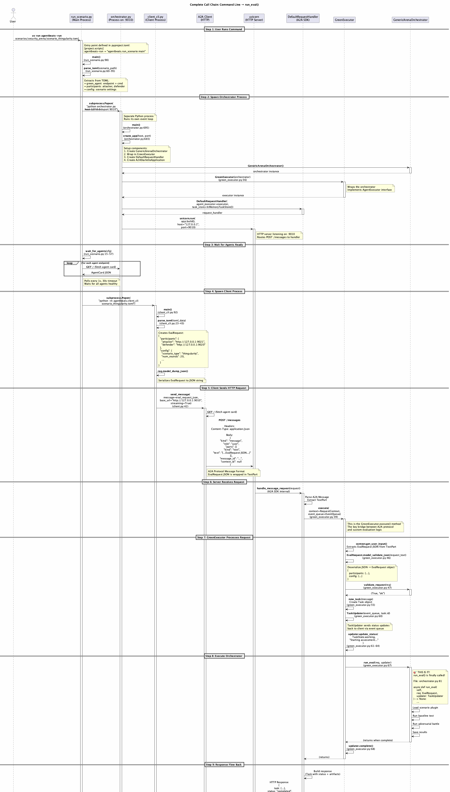

# How run_eval() Gets Started

This document explains the complete call chain from running the command line to when `run_eval()` is invoked.

## Overview Diagram



## Complete Flow

### 1. User Runs Command

```bash
uv run agentbeats-run scenarios/security_arena/scenario_thingularity.toml
```

**What happens:**
- `pyproject.toml` defines: `agentbeats-run = "agentbeats.run_scenario:main"`
- Python calls `src/agentbeats/run_scenario.py:main()`

### 2. Main Process: Parse Configuration

**File:** `src/agentbeats/run_scenario.py:98-107`

```python
def main():
    args = parser.parse_args()  # Get scenario path from CLI
    cfg = parse_toml(args.scenario)  # Parse TOML file
    # ...
```

**`parse_toml()` extracts** (lines 60-95):
```python
{
    "green_agent": {
        "host": "127.0.0.1",
        "port": 9010,
        "cmd": "python scenarios/security_arena/orchestrator.py --host 127.0.0.1 --port 9010"
    },
    "participants": [
        {"role": "attacker", "host": "127.0.0.1", "port": 9021, "cmd": "..."},
        {"role": "defender", "host": "127.0.0.1", "port": 9020, "cmd": "..."}
    ],
    "config": {
        "scenario_type": "thingularity",
        "num_rounds": 20,
        "hidden_tools": [...],
        "public_tools": [...]
    }
}
```

### 3. Main Process: Spawn Orchestrator

**File:** `src/agentbeats/run_scenario.py:129-139`

```python
# Start orchestrator process
green_cmd_args = shlex.split(cfg["green_agent"].get("cmd", ""))
procs.append(subprocess.Popen(
    green_cmd_args,  # ["python", "orchestrator.py", "--host", "127.0.0.1", "--port", "9010"]
    env=base_env,
    stdout=sink,
    stderr=sink,
    text=True,
    start_new_session=True,  # New process group
))
```

**Result:** New Python process starts running `orchestrator.py`

### 4. Orchestrator Process: Server Setup

**File:** `scenarios/security_arena/orchestrator.py:695-711`

```python
async def main():
    parser = argparse.ArgumentParser()
    parser.add_argument("--host", default="127.0.0.1")
    parser.add_argument("--port", type=int, default=9010)
    args = parser.parse_args()

    app = create_app(args.host, args.port)  # ← Create A2A application

    uvicorn_config = uvicorn.Config(app.build(), host=args.host, port=args.port)
    uvicorn_server = uvicorn.Server(uvicorn_config)
    await uvicorn_server.serve()  # ← Start HTTP server

if __name__ == "__main__":
    asyncio.run(main())
```

### 5. Orchestrator Process: Create Components

**File:** `scenarios/security_arena/orchestrator.py:665-692`

```python
def create_app(host: str, port: int):
    # 1. Create agent card (metadata)
    card = AgentCard(
        name="Security Arena Orchestrator",
        url=f"http://{host}:{port}/",
        ...
    )

    # 2. Create orchestrator (contains run_eval)
    orchestrator = GenericArenaOrchestrator()  # ← Has run_eval() method

    # 3. Wrap in GreenExecutor
    executor = GreenExecutor(orchestrator)  # ← Bridges A2A → run_eval

    # 4. Create request handler
    request_handler = DefaultRequestHandler(
        agent_executor=executor,  # ← Will call executor.execute()
        task_store=InMemoryTaskStore()
    )

    # 5. Create A2A application
    app = A2AStarletteApplication(
        agent_card=card,
        http_handler=request_handler  # ← Routes HTTP → handler
    )

    return app
```

**Component Stack:**
```
HTTP Request
    ↓
A2AStarletteApplication (Starlette/ASGI)
    ↓
DefaultRequestHandler (A2A SDK)
    ↓
GreenExecutor.execute() (agentbeats/green_executor.py)
    ↓
GenericArenaOrchestrator.run_eval() (orchestrator.py)
```

### 6. Main Process: Wait for Agents Ready

**File:** `src/agentbeats/run_scenario.py:142-144`

```python
if not asyncio.run(wait_for_agents(cfg)):
    print("Error: Not all agents became ready. Exiting.")
    return
```

**`wait_for_agents()` logic** (lines 15-57):
```python
async def wait_for_agents(cfg: dict, timeout: int = 30) -> bool:
    endpoints = [
        "http://127.0.0.1:9010",  # Orchestrator
        "http://127.0.0.1:9021",  # Attacker
        "http://127.0.0.1:9020",  # Defender
    ]

    while time.time() - start_time < timeout:
        for endpoint in endpoints:
            # Try to fetch agent card
            agent_card = await resolver.get_agent_card()  # GET /
            # If successful, agent is ready

        if all_ready:
            return True

        await asyncio.sleep(1)  # Poll every 1 second
```

### 7. Main Process: Spawn Client

**File:** `src/agentbeats/run_scenario.py:155-161`

```python
# Launch client to send evaluation request
client_proc = subprocess.Popen(
    [sys.executable, "-m", "agentbeats.client_cli", args.scenario],
    env=base_env,
    start_new_session=True,
)
procs.append(client_proc)
client_proc.wait()  # Wait for client to complete
```

**Result:** New Python process starts running `client_cli.py`

### 8. Client Process: Parse and Send Request

**File:** `src/agentbeats/client_cli.py:92-112`

```python
async def main():
    path = Path(sys.argv[1])  # scenario.toml
    toml_data = path.read_text()
    data = tomllib.loads(toml_data)

    # Parse TOML → EvalRequest + orchestrator URL
    req, green_url = parse_toml(data)  # ← Returns (EvalRequest, "http://127.0.0.1:9010")

    # Serialize EvalRequest to JSON
    msg = req.model_dump_json()

    # Send to orchestrator via A2A protocol
    await send_message(msg, green_url, streaming=True, consumer=event_consumer)
```

**`parse_toml()` creates** (lines 23-43):
```python
def parse_toml(d: dict) -> tuple[EvalRequest, str]:
    green_endpoint = d["green_agent"]["endpoint"]  # "http://127.0.0.1:9010"

    # Collect participants
    parts = {}
    for p in d.get("participants", []):
        role = p.get("role")      # "attacker" | "defender"
        endpoint = p.get("endpoint")  # "http://127.0.0.1:9021"
        parts[role] = endpoint

    eval_req = EvalRequest(
        participants=parts,  # {"attacker": "...", "defender": "..."}
        config=d.get("config", {})  # {"scenario_type": "thingularity", ...}
    )

    return eval_req, green_endpoint
```

**Result:** `EvalRequest` object containing participant URLs and scenario config

### 9. Client: Send HTTP Request

**File:** `src/agentbeats/client.py:42-86`

```python
async def send_message(message: str, base_url: str, ...):
    async with httpx.AsyncClient(timeout=DEFAULT_TIMEOUT) as httpx_client:
        # 1. Get agent card
        resolver = A2ACardResolver(httpx_client, base_url)
        agent_card = await resolver.get_agent_card()  # GET http://127.0.0.1:9010/

        # 2. Create A2A client
        config = ClientConfig(httpx_client=httpx_client, streaming=streaming)
        factory = ClientFactory(config)
        client = factory.create(agent_card)

        # 3. Create A2A Message with EvalRequest JSON in TextPart
        outbound_msg = create_message(text=message, context_id=context_id)
        # Message {
        #   kind: "message",
        #   role: "user",
        #   parts: [TextPart { text: "{...EvalRequest JSON...}" }],
        #   message_id: "...",
        #   context_id: null
        # }

        # 4. Send via A2A protocol
        async for event in client.send_message(outbound_msg):
            # POST http://127.0.0.1:9010/messages
            # Body: A2A Message JSON
            ...
```

**HTTP Request:**
```http
POST http://127.0.0.1:9010/messages
Content-Type: application/json

{
  "kind": "message",
  "role": "user",
  "parts": [
    {
      "kind": "text",
      "text": "{\"participants\": {...}, \"config\": {...}}"
    }
  ],
  "message_id": "abc123",
  "context_id": null
}
```

### 10. Server: Route Request

**Orchestrator Process**

```
uvicorn HTTP server
    ↓ (routes POST /messages)
A2AStarletteApplication
    ↓ (parses A2A Message)
DefaultRequestHandler.handle_message_request()
    ↓ (extracts context)
GreenExecutor.execute(context, event_queue)
```

### 11. GreenExecutor: Parse and Validate

**File:** `src/agentbeats/green_executor.py:39-73`

```python
async def execute(self, context: RequestContext, event_queue: EventQueue):
    # 1. Extract EvalRequest JSON from TextPart
    request_text = context.get_user_input()
    # request_text = '{"participants": {...}, "config": {...}}'

    # 2. Deserialize JSON → EvalRequest object
    try:
        req: EvalRequest = EvalRequest.model_validate_json(request_text)
        # req = EvalRequest(
        #     participants={"attacker": "...", "defender": "..."},
        #     config={"scenario_type": "thingularity", ...}
        # )

        # 3. Validate request
        ok, msg = self.agent.validate_request(req)
        if not ok:
            raise ServerError(error=InvalidParamsError(message=msg))
    except ValidationError as e:
        raise ServerError(error=InvalidParamsError(message=e.json()))

    # 4. Create Task
    task = new_task(context.message)
    await event_queue.enqueue_event(task)

    # 5. Create TaskUpdater (sends status updates to client)
    updater = TaskUpdater(event_queue, task.id, task.context_id)

    # 6. Send initial status
    await updater.update_status(
        TaskState.working,
        new_agent_text_message(f"Starting assessment.\n{req.model_dump_json()}")
    )

    # 7. 🎯 CALL RUN_EVAL!
    try:
        await self.agent.run_eval(req, updater)  # ← THIS IS IT!
        await updater.complete()
    except Exception as e:
        await updater.failed(...)
        raise ServerError(...)
```

### 12. Finally: run_eval() Executes!

**File:** `scenarios/security_arena/orchestrator.py:81`

```python
async def run_eval(self, req: EvalRequest, updater: TaskUpdater) -> None:
    """
    Main orchestration logic for the arena battle.
    """
    logger.info(f"Starting Security Arena: {req}")

    try:
        # Parse config and load scenario plugin
        config = ArenaConfig(**req.config)
        scenario = load_scenario(config.scenario_type, req.config)

        # Phase 1: Baseline Test
        baseline_result = await self._test_baseline(...)

        # Phase 2: Adversarial Battle
        battle_result = await self._run_adversarial_battle(...)

        # Phase 3: Save Results
        await self._save_results(...)

    except Exception as e:
        logger.error(f"Arena error: {e}")
        raise
    finally:
        self._tool_provider.reset()
```

---

## Summary: Complete Call Chain

```
1. User Command
   uv run agentbeats-run scenario.toml
   ↓

2. Entry Point
   pyproject.toml → run_scenario.py:main()
   ↓

3. Parse Config
   parse_toml() → Extract green_agent, participants, config
   ↓

4. Spawn Processes
   subprocess.Popen(orchestrator.py)
   subprocess.Popen(attacker.py)
   subprocess.Popen(defender.py)
   ↓

5. Orchestrator Setup
   orchestrator.py:main()
     → create_app()
       → GenericArenaOrchestrator()  ← Has run_eval()
       → GreenExecutor(orchestrator)  ← Wraps orchestrator
       → DefaultRequestHandler(executor)
       → A2AStarletteApplication(handler)
     → uvicorn.run(app)  ← Start HTTP server on :9010
   ↓

6. Wait for Ready
   wait_for_agents() → Poll GET / until all respond
   ↓

7. Spawn Client
   subprocess.Popen(client_cli.py)
   ↓

8. Client Sends Request
   client_cli.py:main()
     → parse_toml() → Create EvalRequest
     → send_message() → POST http://127.0.0.1:9010/messages
   ↓

9. Server Routes Request
   uvicorn → A2AStarletteApplication → DefaultRequestHandler
   ↓

10. Execute Handler
    DefaultRequestHandler.handle_message_request()
      → GreenExecutor.execute(context, event_queue)
   ↓

11. Parse & Validate
    GreenExecutor.execute()
      → context.get_user_input() → Extract JSON
      → EvalRequest.model_validate_json() → Deserialize
      → agent.validate_request() → Validate
      → new_task() → Create Task
      → TaskUpdater() → Setup status updates
   ↓

12. 🎯 Call run_eval()
    await self.agent.run_eval(req, updater)
      ↓
    orchestrator.py:run_eval() EXECUTES!
```

## Key Bridges

### Process Boundary
- **Bridge:** `subprocess.Popen()`
- **Crosses:** Main process → Orchestrator process
- **Mechanism:** Operating system process creation

### Network Boundary
- **Bridge:** HTTP POST request
- **Crosses:** Client process → Orchestrator process
- **Mechanism:** `httpx.AsyncClient` → uvicorn server
- **Protocol:** A2A (Agent-to-Agent) over HTTP

### A2A Protocol → Executor
- **Bridge:** `DefaultRequestHandler`
- **Crosses:** HTTP/A2A → Python objects
- **Mechanism:** A2A SDK parses message, calls `executor.execute()`

### Executor → Custom Logic
- **Bridge:** `GreenExecutor`
- **Crosses:** Generic A2A interface → Custom evaluation logic
- **Mechanism:** `GreenExecutor.execute()` calls `agent.run_eval()`

### JSON → Python Objects
- **Bridge:** `EvalRequest.model_validate_json()`
- **Crosses:** JSON string → Pydantic model
- **Mechanism:** Pydantic deserialization

---

## File References

| Step | File | Line | Function |
|------|------|------|----------|
| Entry point | `pyproject.toml` | 22 | `agentbeats-run` script definition |
| Main process | `run_scenario.py` | 98 | `main()` |
| Parse config | `run_scenario.py` | 60 | `parse_toml()` |
| Spawn orchestrator | `run_scenario.py` | 130 | `subprocess.Popen()` |
| Orchestrator main | `orchestrator.py` | 695 | `main()` |
| Create app | `orchestrator.py` | 665 | `create_app()` |
| Create orchestrator | `orchestrator.py` | 678 | `GenericArenaOrchestrator()` |
| Wrap in executor | `orchestrator.py` | 679 | `GreenExecutor(orchestrator)` |
| Create handler | `orchestrator.py` | 682 | `DefaultRequestHandler()` |
| Start server | `orchestrator.py` | 705 | `uvicorn.run()` |
| Spawn client | `run_scenario.py` | 155 | `subprocess.Popen(client_cli)` |
| Client main | `client_cli.py` | 92 | `main()` |
| Client parse | `client_cli.py` | 23 | `parse_toml()` |
| Send message | `client_cli.py` | 108 | `send_message()` |
| HTTP client | `client.py` | 42 | `send_message()` |
| Executor execute | `green_executor.py` | 39 | `execute()` |
| Deserialize | `green_executor.py` | 46 | `EvalRequest.model_validate_json()` |
| Validate | `green_executor.py` | 47 | `agent.validate_request()` |
| **Call run_eval** | **`green_executor.py`** | **67** | **`await self.agent.run_eval()`** |
| **Run eval** | **`orchestrator.py`** | **81** | **`async def run_eval()`** |

---

## Why So Complex?

The multi-layer architecture provides several benefits:

1. **Process Isolation:** Crashes in one agent don't affect others
2. **Network Transparency:** Agents can run on different machines
3. **Protocol Standardization:** A2A protocol enables language-agnostic agents
4. **Separation of Concerns:**
   - `run_scenario.py`: Process lifecycle management
   - `client_cli.py`: Request formatting and display
   - `GreenExecutor`: A2A protocol ↔ custom logic bridge
   - `GenericArenaOrchestrator`: Evaluation logic
5. **Flexibility:** Easy to distribute across machines, swap agents, or add monitoring

The trade-off is added complexity, but this architecture enables powerful distributed agent evaluation scenarios.
